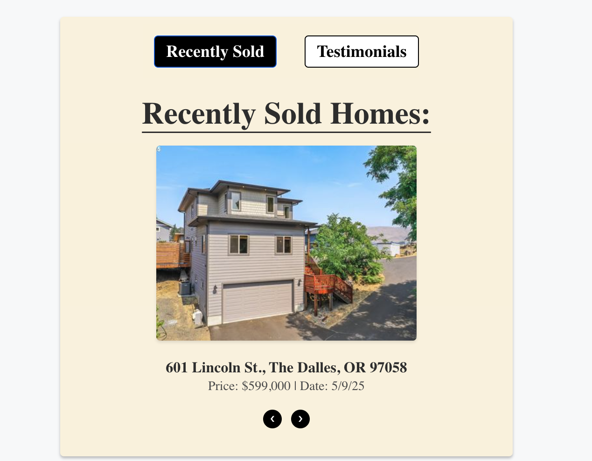
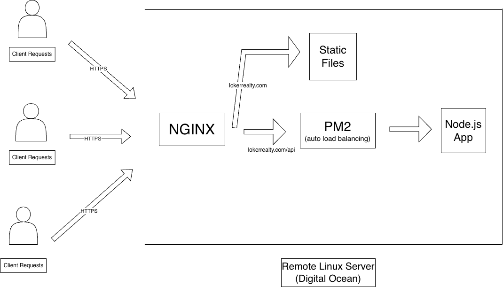

# Loker Realty – Independent Real Estate Brokerage Website

**Live Site:** [lokerrealty.com](https://lokerrealty.com)  
Fully designed, coded, and hosted by me to power my independent real estate brokerage in White Salmon, WA. Built from scratch while closing 16 deals in my first two years.

<!-- Screenshots – Replace with your own (desktop + mobile) -->
### Homepage
 <!-- Add actual paths or URLs -->
### Listing + Testimonial Toggle

### Mobile Homepage


### 🚀 Why I Built This
After years as a data engineer at HelloSign/Dropbox, I pivoted to real estate brokerage. I needed a professional site that stood out in the Columbia Gorge market – clean design, fast loading, SEO-optimized for local searches, and easy to update with new listings.

This project combines my backend skills (Node.js APIs) with front-end design and Linux server management. It's not just a portfolio piece – it's a real business tool generating leads.

### 🛠 Tech Stack
- **Backend:** Node.js + Express (custom APIs for contact forms, SEO metadata)
- **Frontend:** JavaScript, HTML/CSS (responsive design, no frameworks for speed)
- **Hosting:** Self-hosted on a remote Linux server (Nginx, PM2 for process management)
- **Other:** Custom SEO optimization (meta tags, sitemap, Google Analytics integration)

<!-- Optional badges – Add if you have builds/tests -->


### 📐 Architecture Overview
Simple, performant setup:



### 🎯 Key Features & Challenges Solved
- Responsive design for mobile/desktop (critical for on-the-go buyers)
- Dynamic meta tags for better Google rankings on local searches
- Secure contact forms with server-side validation
- Fast page loads (under 2s) via optimized assets and caching
- Easy content updates without a CMS (manual but lightweight)

### 🏗 How to Run Locally
```bash
git clone https://github.com/yourusername/loker-realty.git
cd loker-realty
npm install
node server.js 
